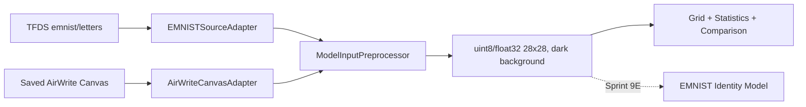

# AirWrite Vocabulary Assistant

Ứng dụng local prototype dùng Computer Vision để người học viết ký tự tiếng Anh trong không khí,
dựng lại nét viết trên canvas và nhận dạng bằng model TensorFlow/Keras. Runtime hiện dùng model EMNIST
E02 để dự đoán 26 letter identities; ký tự hoa hoặc thường do case mode của người dùng quyết định.

## Trạng thái dự án

- **Giai đoạn hiện tại:** Local Prototype / EMNIST Migration
- **Latest technical implementation:** Sprint 11W - Isolated Whole-Word AirWriting
- **Current product sprint:** Sprint 11W (`Automated complete`, real webcam audit pending)
- **Next planned product sprint:** Sprint 12E - Translation and Example Generation
- **Last documentation update:** 2026-08-06

| Hạng mục | Trạng thái | Ghi chú |
| --- | --- | --- |
| Webcam prototype | Completed | Có camera stream, mirror, FPS và xử lý lỗi frame |
| Hand Detection | Completed | MediaPipe Hand Landmarker chạy local |
| Index Finger Tracking | Completed | Theo dõi landmark 8 và làm mượt tọa độ |
| Gesture Control và AirCanvas | Completed | Có state machine và canvas độc lập với camera frame |
| Drawing storage | Completed | Lưu PNG canvas, không lưu raw camera frame |
| Handwriting preprocessing | Completed | Adapter riêng EMNIST/AirWrite, contract `28x28` và normalize `float32` |
| EMNIST-AirWrite alignment | Completed | Transpose được visual-verified; audit 260 EMNIST và 153 AirWrite samples |
| Dataset và training pipeline | Completed | Manifest, validation, split, baseline, CNN và reports |
| Character model v0.1.0 | Legacy baseline | Uppercase custom model; validation `81.63%`, test `79.08%` |
| Character prediction runtime | Implemented | Model E02 được load một lần, trả identity Top-3 và resolve theo case mode |
| Case-controlled output | Automated complete | Lowercase/uppercase và immutable Shift snapshot đã tích hợp; manual webcam pending |
| Local prototype execution | Implemented | Entrypoint có sẵn; phiên camera thật chưa được chạy lại trong lần audit README này |
| Word Builder | Automated complete | Bảo toàn lowercase, uppercase và mixed-case; manual webcam test còn thiếu |
| Whole-Word AirWriting | Automated complete | Viết cả từ bằng chữ rời, DONE một lần, review và atomic commit; audit webcam còn thiếu |
| Candidate correction | Implemented | Kết quả `UNCERTAIN` được giữ pending để chọn Top-3 bằng phím `1/2/3` hoặc hủy bằng `X` |
| EMNIST identity model | Completed baseline | E02 selected; EMNIST test `94.37%`, AirWrite custom `64.12%` |
| Translation, Example Generation, Vocabulary Storage | Deferred | Thực hiện sau nhánh nâng cấp EMNIST/case; chưa có implementation |
| Web MVP và deployment | Planned | Chưa có frontend, backend, database hoặc cấu hình deploy |

Sprint 11W đã hoàn thành implementation và kiểm thử tổng hợp. Các kịch bản webcam thật (`cat`, `Cat`,
`CAT`, `AirWrite`, `apple`, `education`), benchmark thực tế và phiên soak 50 từ vẫn là manual gate.
Sprint 8E không tạo 52 class: EMNIST Letters gộp chữ hoa và chữ thường của cùng chữ vào 26 letter
identities. Sprint 10E thêm case output/control; Sprint 11E lưu chính xác case của từng ký tự.

### Sprint 9E: EMNIST Letters identity model

Sprint 9E dùng bốn file IDX/GZIP chính thức làm nguồn dữ liệu chuẩn, không lấy `num_classes` hoặc số
mẫu từ metadata TFDS. Audit hiện đã xác nhận:

- Official train: `124,800` ảnh; official test: `20,800` ảnh.
- Raw labels: `1-26`; model labels: `0-25`; đúng `26` letter identities `a-z`.
- Mỗi identity có `4,800` mẫu train gốc và `800` mẫu official test.
- Validation tách có stratify từ official train với seed `42`: `112,320` train và `12,480` validation.
- Official test được giữ nguyên trong quá trình chọn model và chỉ evaluate sau khi chọn E02.

E01 và E02 đã được train trên cùng validation split; E02 augmentation nhẹ được chọn. Model đạt
`94.37%` accuracy, `94.38%` Macro F1 và `99.50%` Top-3 trên official test. Trên 1.600 mẫu AirWrite
custom unique, model đạt `64.12%` overall, `62.17%` cho uppercase style và `72.79%` cho lowercase style.
Khoảng cách này xác nhận domain gap còn lớn. Sprint 10E đã thay runtime model uppercase v0.1.0 bằng
identity model E02; model không tự suy luận case và không được tune lại trong bước tích hợp.

### Character case behavior

Model dự đoán đúng 26 identity trung lập case trong thứ tự `a-z`. `CaseLabelResolver` dùng case mode
được snapshot tại thời điểm prediction để render identity thành `a-z` hoặc `A-Z`; confidence và margin
không đổi giữa hai mode. Phím mặc định là `L` cho lowercase, `U` cho uppercase, `Y` cho Shift-next và
`Z` để hủy Shift. Không có AUTO case vì EMNIST Letters không cung cấp nhãn case riêng.

### Case-preserving word building

- Model dự đoán identity chữ cái trung lập case.
- Case mode quyết định ký tự hiển thị được chuyển vào Word Builder.
- Word Builder giữ nguyên từng `rendered_character`, không tự đổi hoa hoặc thường.
- `cat`, `Cat`, `CAT` và các từ mixed-case là những original form khác nhau.
- Canonical lowercase form chỉ được tạo bằng `casefold()` cho dictionary lookup trong Sprint sau.

### Isolated whole-word AirWriting

- Nhấn `W` để dùng Word Mode và viết một từ bằng các chữ cái rời, từ trái sang phải, có khoảng cách rõ.
- Thực hiện `DONE` đúng một lần sau khi viết xong toàn bộ từ; model E02 được gọi một batch cho mọi segment.
- Kết quả đi vào `WholeWordDraft`, chưa vào Word Builder ngay. Dùng `[ ]` để đổi vị trí, `1/2/3` để chọn
  candidate, `G` đổi case, `S` tách segment, `V` gộp segment kế tiếp, `A` accept hoặc `X` cancel.
- Word Mode hỗ trợ `LOWERCASE`, `UPPERCASE`, `CAPITALIZE_FIRST`, `CUSTOM`; model không tự đoán case.
- Khi draft hợp lệ, toàn bộ ký tự được commit nguyên tử vào Word Builder. Nhấn Enter riêng để Confirm.
- Nhấn `R` để trở về Character Mode một ký tự cho mỗi lần DONE.
- Chưa hỗ trợ chữ nối/cursive, nhiều từ trên một canvas, khoảng trắng, số hoặc dấu câu.

## Tổng quan sản phẩm

### Bối cảnh và vấn đề

Người học tiếng Anh qua phim, video hoặc tài liệu thường phải dừng nội dung, chuyển ứng dụng, nhập
từ bằng bàn phím, tra nghĩa rồi ghi chú thủ công. Luồng này làm gián đoạn việc học và khiến nhiều từ
mới không được lưu để ôn tập.

AirWrite Vocabulary Assistant hướng đến việc giảm số thao tác đó bằng cách cho phép người dùng viết
ký tự trước webcam. Local prototype hiện tại giải quyết phần đầu của bài toán: camera, nhận diện tay,
theo dõi ngón trỏ, dựng canvas, tiền xử lý ảnh và dự đoán một chữ cái. Model runtime hiện tại vẫn
dùng E02 để dự đoán identity `a-z`; case hiển thị do snapshot lowercase/uppercase của người dùng.

### Product vision

Luồng sản phẩm mục tiêu là:

```text
Write -> Recognize -> Correct -> Translate -> Save -> Review
```

Trong repository hiện tại:

- `Write`, nhận dạng từng ký tự trong `Recognize`, ghép ký tự thành từ và chọn lại một ký tự từ
  Top-3 đã có implementation.
- `Correct` ở Sprint 11 mới là candidate selection theo từng ký tự; chưa phải trình sửa từ hoàn chỉnh.
- `Translate`, lưu vocabulary và `Review` vẫn nằm trong kế hoạch.

Sản phẩm được định vị là trợ lý học từ vựng có tương tác air-writing, không chỉ là demo vẽ bằng
webcam. Tuy nhiên, repository hiện vẫn ở giai đoạn local technical prototype.

## Người dùng mục tiêu

- Người Việt học tiếng Anh, nhóm tuổi tham khảo 18-26.
- Trình độ tiếng Anh ban đầu A2-B1.
- Học qua YouTube, phim, video hoặc tài liệu trên laptop/desktop có webcam.
- Muốn giảm việc chuyển tab khi tra từ và duy trì sự tập trung.
- Cần một luồng tra cứu, sửa kết quả, lưu và ôn tập từ vựng; phần workflow này chưa hoàn chỉnh.

Chi tiết persona và bối cảnh sử dụng nằm trong [Target Users](docs/target_users.md) và
[Problem Statement](docs/problem_statement.md).

## Phạm vi sản phẩm

### Đã triển khai

- Mở và đọc webcam bằng OpenCV.
- Hand Detection bằng MediaPipe Hand Landmarker.
- Index Finger Tracking với exponential smoothing.
- Gesture Detection và ổn định gesture qua nhiều frame.
- Drawing State Machine: `IDLE`, `READY`, `WRITING`, `PAUSED`, `DONE`, `CLEAR`, `ERROR`.
- AirCanvas, stroke continuity và canvas overlay.
- Lưu canvas dưới dạng PNG khi vào `DONE` hoặc khi người dùng yêu cầu.
- Handwriting Image Preprocessing thành ảnh grayscale `28x28` và normalized `float32`.
- Model-input contract chung cho EMNIST và AirWrite.
- `EMNISTSourceAdapter` sửa orientation đúng một lần, giữ grayscale và không crop/threshold.
- `AirWriteCanvasAdapter` crop toàn bộ foreground, giữ aspect ratio và component tách rời.
- Audit grid/statistics/comparison cho 260 EMNIST và 153 AirWrite samples.
- Thu thập custom dataset A-Z từ canvas đã preprocessing.
- Dataset scanning, validation, exact duplicate detection, manifest và stratified split.
- Baseline training, CNN training, evaluation và artifact export.
- Load và validate model bundle v0.1.0.
- Top-1/Top-3 Character Prediction với confidence và confidence margin.
- Trạng thái `ACCEPTED`, `UNCERTAIN`, `SKIPPED_EMPTY`, `FAILED`.
- Auto prediction khi vừa vào `DONE` và manual prediction bằng phím `I`.
- Prediction event có `prediction_id` duy nhất để ngăn cộng trùng một ký tự.
- Word Builder tích lũy chữ cái `a-z` và `A-Z`, giữ nguyên case và cho phép ký tự lặp từ các prediction event khác nhau.
- Pending Top-3 selection, backspace, clear, confirm và bắt đầu từ mới.
- Tự động xóa canvas sau khi commit ký tự hoặc hủy pending thành công; không xóa sau prediction lỗi.
- Unified OpenCV HUD ở góc trên phải hiển thị mode, case, từ hiện tại, tracking, state và prediction/draft
  bằng một font chữ đen 13 px trên nền sáng; nội dung tự wrap và không tạo nhiều panel chồng nhau.

### Đang phát triển hoặc chưa hoàn chỉnh

- Sprint 11 cần manual webcam test cho các từ mục tiêu và chuỗi ít nhất 10 ký tự.
- Prediction đang chạy synchronous; camera có thể khựng nếu latency tăng đáng kể.
- Unified HUD và keyboard flow vẫn là prototype UI, chưa phải correction interface hoàn chỉnh.
- Dataset và model đã được đánh giá trên tập custom hạn chế; khả năng tổng quát cho nhiều người viết
  chưa được xác minh.
- AirWrite model inputs hiện nhỏ và thưa hơn EMNIST; content size/stroke thickness chưa được tối ưu.
- Runtime dùng model EMNIST letter-identity E02; model uppercase v0.1.0 được giữ làm legacy baseline.

### Kế hoạch tương lai

Nhánh kỹ thuật tiếp theo là Sprint 9E để train model EMNIST letter-identity. Translation và Example
Generation vẫn là hướng sản phẩm Sprint 12 nhưng được lùi sau chuỗi nâng cấp 9E-11E.

- Translation, dictionary lookup và example generation.
- Correction Flow ở mức từ hoàn chỉnh.
- Local Vocabulary Storage và Review System.
- Flashcard và Spaced Repetition.
- Web MVP, authentication và cloud database.
- Chrome Extension, deployment, monitoring và subscription.

## Luồng hoạt động hiện tại

```mermaid
flowchart LR
    Camera["OpenCV Camera"] --> Hand["MediaPipe Hand Detection"]
    Hand --> Finger["Index Finger Tracking"]
    Hand --> Gesture["Gesture Detection"]
    Finger --> Drawing["Drawing Controller"]
    Gesture --> Drawing
    Drawing --> Canvas["AirCanvas"]
    Canvas --> Snapshot["Canvas Snapshot"]
    Snapshot --> Save["Local PNG Save"]
    Snapshot --> Preprocess["AirWrite Canvas Adapter"]
    Preprocess --> Contract["Shared Model-Input Contract"]
    Contract --> Input["float32 28x28x1"]
    Input --> Model["Keras Model v0.1.0"]
    Model --> Policy["Top-K Confidence Policy"]
    Policy --> Result["Prediction Result"]
    Result -->|"ACCEPTED"| Append["Append Character"]
    Result -->|"UNCERTAIN"| Pending["Pending Top-3 Selection"]
    Pending --> Append
    Append --> Word["Current Word"]
    Word --> Confirm["Confirmed Word"]
```



Model không nhận raw camera frame. Khi state vừa chuyển sang `DONE`, coordinator tạo đúng một
snapshot trong RAM, dùng cùng snapshot cho save và prediction, rồi chặn prediction lặp khi state vẫn
giữ ở `DONE`. Mỗi prediction event có một ID riêng; Word Builder chỉ append một lần cho mỗi ID và
chỉ clear canvas sau khi append thành công.

Luồng chuẩn bị dữ liệu của Sprint 8E tách khỏi runtime model hiện tại:



## Kiến trúc hệ thống

| Khu vực | Trách nhiệm |
| --- | --- |
| `app/camera` | Mở webcam, đọc/validate frame, mirror, tính FPS và debug overlay cơ bản |
| `app/vision` | Hand Detection, landmark rendering, Finger Tracking, Gesture Detection và stabilization |
| `app/drawing` | AirCanvas, stroke segments, state machine, drawing controller và canvas overlay |
| `app/storage` | Lưu clean canvas snapshot và custom A-Z dataset image dưới dạng PNG |
| `app/preprocessing` | Shared contract, EMNIST/AirWrite adapters, normalize, audit statistics và façade tương thích |
| `app/ml` | Dataset contract, scan/validate/split, training data, model builder/trainer/evaluator/exporter |
| `app/inference` | Load/validate model bundle, predict Top-K, confidence policy, workflow và renderer |
| `app/word_builder` | Domain state, event deduplication, pending Top-3 selection, word actions và OpenCV renderer |
| `app/status_hud_renderer.py` | Gom status camera, prediction, Word Builder và Whole-Word vào một HUD góc trên phải |
| `app/utils` | Đọc `.env`, validation cấu hình và logging |
| `app/recognition` | Package placeholder; runtime recognition thực tế hiện nằm trong `app/inference` |
| `app/vocabulary` | Package placeholder; chưa có translation hoặc vocabulary storage |
| `app/main.py` | Composition root và camera loop; điều phối module thay vì chứa model logic |

[Architecture Overview](docs/architecture_overview.md) mô tả cả kiến trúc hiện tại và kiến trúc
mục tiêu. Word Builder hiện nằm trong `app/word_builder`; Translation, Vocabulary, backend và
database vẫn là target architecture.

## Cấu trúc repository

```text
airwrite-vocab-assistant/
|-- app/
|   |-- camera/
|   |-- drawing/
|   |-- inference/
|   |-- ml/
|   |-- preprocessing/
|   |-- recognition/
|   |-- storage/
|   |-- utils/
|   |-- vision/
|   |-- vocabulary/
|   `-- word_builder/
|-- artifacts/
|   |-- labels/
|   |-- metadata/
|   |-- models/
|   `-- reports/
|-- data/
|   |-- drawings/
|   |-- external/emnist/       # local TFDS cache, Git ignored
|   |-- manifests/
|   |-- preprocessed_debug/
|   |-- raw_airwrite/
|   `-- training_cache/
|-- docs/
|-- models/
|-- scripts/
|-- tests/
|-- .env.example
|-- .gitignore
|-- pyproject.toml
|-- requirements.txt
|-- requirements-dev.txt
|-- requirements-ml.txt
|-- requirements-training.txt
`-- README.md
```

- `models/hand_landmarker.task` và `artifacts/models/character_recognizer.keras` là artifact local,
  bị loại khỏi Git theo `.gitignore`.
- `data/raw_airwrite/*` và ảnh runtime cũng bị loại khỏi Git; clone mới không có custom raw dataset.
- `data/external/emnist/` và `artifacts/preprocessing_audit/` là cache/artifact local bị Git ignore.
- Labels, metadata, metrics, manifests và evaluation reports hiện được version-control.
- `docs/sprint_11e_manual_test_plan.md` là checklist kiểm thử thủ công cho Word Builder; các
  Sprint cũ có thể không còn test plan tương ứng tại `HEAD`.

## Yêu cầu hệ thống

- Python: tooling trong `pyproject.toml` đặt target `3.11`; repository không khai báo ma trận phiên
  bản Python khác.
- Hệ điều hành: hướng dẫn và quá trình phát triển hiện dùng Windows PowerShell. Hệ điều hành khác
  chưa được xác minh từ repository.
- Webcam tương thích với OpenCV.
- MediaPipe Hand Landmarker model dạng `.task`.
- TensorFlow/Keras model dạng `.keras` nếu cần Character Prediction.
- Git cho clone, branch và review workflow.

Dependency chính:

- Runtime camera/drawing: `opencv-python`, `mediapipe`, `numpy`, `python-dotenv`.
- Development: `pytest`, `pytest-cov`, `ruff`, `mypy`.
- Training và prediction model: `tensorflow`, `scikit-learn`, `matplotlib`.

## Cài đặt trên Windows PowerShell

### 1. Clone và tạo virtual environment

Thay `<repository-url>` bằng URL thật của repository:

```powershell
git clone <repository-url>
cd airwrite-vocab-assistant
python -m venv .venv
.venv\Scripts\Activate.ps1
python -m pip install --upgrade pip
```

Nếu PowerShell chặn activation script, có thể cấp quyền cho process hiện tại:

```powershell
Set-ExecutionPolicy -Scope Process -ExecutionPolicy Bypass
.venv\Scripts\Activate.ps1
```

### 2. Cài dependency

Camera, drawing và preprocessing:

```powershell
python -m pip install -r requirements.txt
```

Development tools:

```powershell
python -m pip install -r requirements-dev.txt
```

Character Prediction hoặc training:

```powershell
python -m pip install -r requirements-training.txt
```

`requirements-training.txt` đã bao gồm runtime dependency thông qua `requirements.txt`. Nếu chỉ cài
`requirements.txt`, ứng dụng vẫn có thể chạy camera/drawing nhưng prediction sẽ bị disable khi Keras
không khả dụng.

### 3. Tạo cấu hình local

```powershell
Copy-Item .env.example .env
```

Không commit `.env`. File này đã nằm trong `.gitignore`.

### 4. Chuẩn bị model local

Đặt MediaPipe Hand Landmarker model tương thích tại:

```text
models/hand_landmarker.task
```

Để bật Character Prediction, đặt model v0.1.0 tại:

```text
artifacts/models/character_recognizer.keras
```

Các artifact đi kèm đã có trong repository:

```text
artifacts/labels/labels.json
artifacts/metadata/model_metadata.json
artifacts/metadata/preprocessing_config.json
```

Loader không tự tìm model khác. Nếu model thiếu, sai SHA-256 hoặc không tương thích, prediction bị
disable và camera/drawing vẫn tiếp tục.

### 5. Chạy ứng dụng

```powershell
python -m app.main
```

Việc import entrypoint và automated tests đã được xác minh, nhưng người dùng mới vẫn cần kiểm tra
webcam, quyền camera và model artifact trên máy của mình.

## Cấu hình môi trường

Toàn bộ giá trị mặc định nằm trong [`.env.example`](.env.example). Các nhóm quan trọng:

| Nhóm | Biến tiêu biểu | Ý nghĩa |
| --- | --- | --- |
| Application | `APP_NAME`, `APP_ENV`, `LOG_LEVEL` | Tên app, môi trường và logging |
| Camera | `CAMERA_INDEX`, `CAMERA_WIDTH`, `CAMERA_HEIGHT`, `CAMERA_FPS`, `CAMERA_MIRROR` | Thiết bị và frame request |
| Hand Detection | `HAND_LANDMARKER_MODEL_PATH`, `HAND_NUM_HANDS`, các confidence threshold | MediaPipe model và detection policy |
| Finger Tracking | `INDEX_FINGER_LANDMARK_INDEX`, `FINGER_SMOOTHING_ALPHA` | Landmark và độ làm mượt |
| Canvas | `CANVAS_*`, `SHOW_CAMERA_WITH_CANVAS`, `SHOW_CANVAS_WINDOW` | Màu, độ dày, overlay và cửa sổ |
| Gesture | `GESTURE_STABLE_FRAMES`, `GESTURE_COOLDOWN_MS`, `ENABLE_GESTURE_CONTROL` | Stabilization và state transitions |
| Drawing Storage | `DRAWING_OUTPUT_DIR`, `AUTO_SAVE_ON_DONE`, `MANUAL_SAVE_KEY` | Lưu canvas sạch |
| Model-input contract | `MODEL_INPUT_*` | Shape, channels, background và normalization divisor |
| AirWrite adaptation | `AIRWRITE_*`, `MANUAL_PREPROCESS_KEY` | Mask, crop, content size, centering và debug output |
| EMNIST audit | `EMNIST_*`, `PREPROCESS_AUDIT_*` | Dataset cache, transpose, grayscale và local artifacts |
| Dataset Capture | `ENABLE_DATASET_CAPTURE`, `DATASET_CAPTURE_*` | Thu thập mẫu uppercase hoặc lowercase từ app |
| Training | `DATASET_*`, `TRAIN_*`, `MODEL_OUTPUT_PATH` | Manifest, split, hyperparameters và output |
| Inference | `CHARACTER_MODEL_PATH`, `PREDICTION_TOP_K`, `PREDICTION_MIN_*` | Model bundle và confidence policy |
| Prediction UI | `SHOW_PREDICTION_STATUS`, `SHOW_TOP_K_PREDICTIONS`, `PREDICTION_STATUS_DISPLAY_MS` | Overlay prediction |
| Word Builder | `WORD_MAX_LENGTH`, `WORD_CANONICALIZATION`, `WORD_AUTO_APPEND_ACCEPTED`, `WORD_REQUIRE_SELECTION_FOR_UNCERTAIN` | Giới hạn từ, canonical form và append policy |
| Word Builder UI | `WORD_*_KEY`, `SHOW_WORD_BUILDER`, `SHOW_PENDING_CANDIDATES`, `WORD_STATUS_DISPLAY_MS` | Phím điều khiển và panel |
| Canvas handoff | `AUTO_CLEAR_CANVAS_AFTER_CHARACTER`, `AUTO_CLEAR_CANVAS_AFTER_PENDING_CANCEL` | Clear canvas sau commit hoặc hủy pending |

`ENABLE_CLEAR_GESTURE` và `CLEAR_HOLD_MS` có trong cấu hình, nhưng current camera loop chưa có luồng
clear-by-hold hoàn chỉnh; phím `C` là cách clear đã được xác minh từ code.

## Điều khiển khi chạy ứng dụng

Các phím dưới đây là mặc định trong `.env.example` hoặc được xác định trực tiếp trong `app/main.py`:

| Phím | Chức năng |
| --- | --- |
| `Q` hoặc `ESC` | Thoát ứng dụng |
| `Space` | Chuyển giữa `WRITING` và `PAUSED` khi keyboard fallback bật |
| `D` | Đưa drawing state sang `DONE` |
| `C` | Xóa canvas |
| `S` | Lưu canvas thủ công |
| `P` | Chạy preprocessing thủ công và mở preview |
| `I` | Chạy prediction hiện tại, không bắt buộc save hoặc đổi state |
| `V` | Lưu ảnh đã preprocessing vào custom dataset label hiện tại |
| `[` | Chọn label dataset trước đó |
| `]` | Chọn label dataset tiếp theo |
| `L` | Khóa mode lowercase và hủy Shift-next hiện tại |
| `U` | Khóa mode uppercase và hủy Shift-next hiện tại |
| `Y` | Bật/tắt Shift cho đúng một ký tự tiếp theo |
| `Z` | Hủy Shift-next, không đổi locked mode |
| `1`, `2`, `3` | Chọn candidate theo rank khi một prediction đang ở trạng thái pending |
| `X` | Hủy candidate pending; không thêm ký tự |
| `B` hoặc `Backspace` | Xóa ký tự cuối của từ hiện tại |
| `K` | Xóa toàn bộ từ hiện tại và lịch sử prediction ID của từ đó |
| `Enter` | Confirm từ hiện tại |
| `N` | Bắt đầu từ mới sau khi confirm |

Thu thập chính xác một số lượng mẫu mới cho một chữ cụ thể:

```powershell
python scripts/collect_custom_data.py Z --limit 63
python scripts/collect_custom_data.py r --limit 50
```

Chữ hoa/thường được suy ra từ đối số (`Z` hoặc `r`). Có thể ghi đè bằng
`--style uppercase` hoặc `--style lowercase`. Vẽ một mẫu rồi nhấn `v`; canvas tự xóa và ứng dụng
tự đóng sau khi lưu đủ số lượng. Khi đang thu thập có giới hạn, phím đổi nhãn bị khóa.

Khi có candidate pending, nhóm phím `1/2/3/X` được ưu tiên trước các lệnh canvas để tránh tạo thêm
prediction khi quyết định cũ chưa được xử lý. Các phím cấu hình có thể đổi trong `.env`. Dataset
capture mặc định bật. Uppercase được lưu dưới `data/raw_airwrite/<A-Z>/`; lowercase được lưu dưới
`data/raw_airwrite/lowercase/<a-z>/`. Hai tầng này là bắt buộc trên Windows vì `A` và `a` không thể
là hai thư mục cùng cấp khác nhau. Raw dataset không được commit.

## Lịch sử phát triển theo Sprint

### Tổng quan

| Sprint | Chủ đề | Trạng thái | Kết quả chính | Bằng chứng/tài liệu |
| --- | --- | --- | --- | --- |
| Sprint 0 | Product Vision & Planning | Completed | Vision, problem, users, MVP và architecture | [`docs/product_vision.md`](docs/product_vision.md) |
| Sprint 1 | Environment & Project Structure | Completed | Python layout, config, logger, requirements và quality config | Git commits `6b6fd8c`, `7a86b66` |
| Sprint 2 | Webcam Prototype | Completed | Camera stream, frame processing và FPS | `app/camera`, commit `0005a6c` |
| Sprint 3 | Hand Detection | Completed | MediaPipe detection và landmark renderer | `app/vision/hand_detector.py`, commit `28c42c4` |
| Sprint 4 | Index Finger Tracking | Completed | Landmark 8, smoothing và debug cursor | `app/vision/index_finger_tracker.py`, commit `ea8c984` |
| Sprint 5 | Air Drawing Canvas | Completed | Canvas, stroke manager và overlay | `app/drawing/air_canvas.py`, commit `0f5c99f` |
| Sprint 6 | Gesture Control & Drawing State | Completed | Gesture stabilizer, state machine và controller | `app/drawing/drawing_state_machine.py`, commit `b5305f6` |
| Sprint 7 | Save Drawing Image | Completed | Auto/manual PNG save và one-shot DONE handling | `app/storage`, commit `8090050` |
| Sprint 8 | Handwriting Image Preprocessing | Completed | Crop, resize, center và normalize `28x28` | `app/preprocessing`, commit `1389e38` |
| Sprint 8E | EMNIST-AirWrite Preprocessing Alignment | Completed | Shared contract, source adapters và visual/domain audit | [`docs/emnist_airwrite_input_contract.md`](docs/emnist_airwrite_input_contract.md) |
| Sprint 9 | Dataset Preparation & Model Training | Completed | Custom dataset, manifests, CNN v0.1.0 và reports | [`docs/model_card.md`](docs/model_card.md) |
| Sprint 10 | Character Prediction Integration | Completed | Bundle validation, Top-K prediction, policy và overlay | [`docs/model_runtime_contract.md`](docs/model_runtime_contract.md) |
| Sprint 11 | Word Builder | In Progress | Event-safe character accumulation, Top-3 selection và word controls | [`docs/word_builder_state_flow.md`](docs/word_builder_state_flow.md) |
| Sprint 9E | EMNIST Letter-Identity Model Training | Completed baseline | E02 selected; official EMNIST test và custom AirWrite evaluation đã hoàn tất | [`docs/emnist_letters_model_card.md`](docs/emnist_letters_model_card.md) |
| Sprint 10E | Case-Controlled Identity Prediction | In Progress | Automated implementation complete; manual webcam validation pending | [`docs/case_controlled_inference_contract.md`](docs/case_controlled_inference_contract.md) |
| Sprint 11E | Case-Preserving Word Builder | In Progress | Automated implementation complete; lowercase, uppercase, mixed-case và Shift lifecycle | [`docs/case_preserving_word_contract.md`](docs/case_preserving_word_contract.md) |
| Sprint 11W | Isolated Whole-Word AirWriting | In Progress | Automated implementation complete; segmentation, batch prediction, draft review và atomic commit; webcam audit pending | [`docs/whole_word_input_contract.md`](docs/whole_word_input_contract.md) |
| Sprint 12 | Translation and Example Generation | Deferred | Nhận confirmed word sau chuỗi nâng cấp case | Chưa có implementation |

### Sprint 0 - Product Vision & Planning

**Trạng thái:** Completed

**Thời gian:** Không có commit Sprint 0 riêng. Bộ tài liệu planning được đưa vào Git ngày 2026-07-13.

**Mục tiêu:** Xác định vấn đề, người dùng, product vision, MVP, success metrics, rủi ro và kiến trúc
mục tiêu.

**Phạm vi và implementation:** Sprint này tạo tài liệu, chưa xây Computer Vision runtime. Các file
chính gồm `product_vision.md`, `problem_statement.md`, `target_users.md`, `user_flow.md`,
`mvp_scope.md`, `success_metrics.md`, `assumptions_and_risks.md` và `architecture_overview.md`.

**Ngoài phạm vi:** Camera, ML model, backend, web app và production deployment.

**Kiểm thử:** Không áp dụng automated test cho tài liệu. Repository không lưu evidence user research
hoặc product validation thực tế.

**Kết quả:** Có nền tảng sản phẩm và roadmap dài hạn. Một số phần trong architecture/user flow mô tả
target state, không phải chức năng đã triển khai.

### Sprint 1 - Environment Setup, Git and Project Structure

**Trạng thái:** Completed

**Thời gian:** Hoàn thành qua commits ngày 2026-07-13.

**Mục tiêu:** Tạo project skeleton có thể mở rộng và bộ công cụ phát triển cơ bản.

**Phạm vi và implementation:** Tạo `app/`, `scripts/`, `tests/`, `models/`, `data/`; thêm
`app/utils/config.py`, `app/utils/logger.py`, requirements, `.gitignore`, `.env.example` và
`pyproject.toml`.

**Cấu hình:** Application metadata, logging, model/data path ban đầu.

**Kiểm thử:** Thiết lập pytest, Ruff và mypy. Chưa có feature test đáng kể ở đầu Sprint.

**Ngoài phạm vi:** Camera và toàn bộ Computer Vision pipeline.

**Kết quả:** Project structure tách module theo ownership; các package `recognition` và `vocabulary`
được giữ làm placeholder cho tương lai.

### Sprint 2 - Webcam Prototype

**Trạng thái:** Completed

**Thời gian:** Commit ngày 2026-07-13.

**Mục tiêu:** Mở webcam ổn định và tạo vòng lặp hiển thị local.

**Phạm vi và implementation:** `CameraStream` quản lý open/read/release; `FrameProcessor` validate,
mirror, tính FPS và vẽ debug text; `app.main` điều phối vòng lặp và cleanup.

**Cấu hình:** `CAMERA_INDEX`, kích thước, FPS, mirror, window name và `SHOW_FPS`.

**Kiểm thử:** `test_camera_stream.py`, `test_frame_processor.py`.

**Ngoài phạm vi:** Hand Detection, drawing, save và ML.

**Kết quả:** Webcam prototype chạy local; raw frame không được lưu bởi camera layer.

### Sprint 3 - Hand Detection with MediaPipe

**Trạng thái:** Completed

**Thời gian:** Commit ngày 2026-07-13.

**Mục tiêu:** Phát hiện bàn tay và landmark trên mirrored camera frame.

**Phạm vi và implementation:** `HandDetector` dùng MediaPipe VIDEO mode; result dataclasses tách dữ
liệu khỏi SDK; `HandLandmarkRenderer` vẽ landmark, connection và handedness.

**Cấu hình:** Model `.task`, số tay và ba confidence threshold; các toggle renderer.

**Kiểm thử:** `test_hand_detector.py`, `test_hand_landmark_renderer.py` và các frame tests liên quan.
Manual test plan từng có trong commit Sprint 3 nhưng không còn tại `HEAD`.

**Ngoài phạm vi:** Finger Tracking, gesture, canvas và prediction.

**Kết quả:** Hand Detection được tạo một lần, đóng khi cleanup và không thay đổi handedness mapping.

### Sprint 4 - Index Finger Tracking

**Trạng thái:** Completed

**Thời gian:** Commit ngày 2026-07-13.

**Mục tiêu:** Chuyển landmark đầu ngón trỏ thành tọa độ pixel ổn định.

**Phạm vi và implementation:** `IndexFingerTracker` đọc landmark 8, clamp theo frame, exponential
smoothing và reset khi mất tay; `FingerTrackingRenderer` hiển thị raw/smoothed point.

**Cấu hình:** Landmark index, smoothing alpha, point radius và debug draw toggles.

**Kiểm thử:** `test_index_finger_tracker.py`, `test_finger_tracking_renderer.py`.

**Ngoài phạm vi:** Canvas, gestures, save và recognition.

**Kết quả:** Tạo debug cursor ổn định làm đầu vào cho Sprint 5. Summary lịch sử từng tồn tại nhưng
đã bị xóa ở commit Sprint 6.

### Sprint 5 - Air Drawing Canvas

**Trạng thái:** Completed

**Thời gian:** Commit ngày 2026-07-13.

**Mục tiêu:** Dựng nét viết bền vững từ smoothed fingertip point.

**Phạm vi và implementation:** `AirCanvas` sở hữu ảnh canvas độc lập; `StrokeManager` nối điểm và
lọc jump; `CanvasOverlayRenderer` trộn canvas với preview mà không mutate input.

**Cấu hình:** Background/stroke color, thickness, max point distance, opacity và display toggles.

**Kiểm thử:** `test_air_canvas.py`, `test_stroke_manager.py`, `test_canvas_overlay_renderer.py`.
Manual test plan từng có trong Git history nhưng không còn tại `HEAD`.

**Ngoài phạm vi:** Gesture control, image saving, preprocessing và prediction.

**Kết quả:** Có AirCanvas local và clear bằng phím; canvas resize an toàn khi frame size đổi.

### Sprint 6 - Gesture Control and Drawing State Machine

**Trạng thái:** Completed

**Thời gian:** Commit ngày 2026-07-14.

**Mục tiêu:** Tách hand shape khỏi drawing state và giảm flicker gesture.

**Phạm vi và implementation:** `GestureDetector`, `GestureStabilizer`, `DrawingStateMachine` và
`DrawingController`; chỉ vẽ trong `WRITING`; reset stroke khi chuyển state.

**Cấu hình:** Stable frames, cooldown, lost-hand frames, gesture toggles và keyboard fallback.

**Kiểm thử:** Gesture detector/stabilizer, drawing state machine và controller tests.

**Ngoài phạm vi:** Save, preprocessing, prediction và correction workflow.

**Kết quả:** Gesture `INDEX_ONLY`, `OPEN_PALM`, `FIST`, `UNKNOWN`, `NO_HAND` điều khiển state. Clear
gesture qua hold chưa được nối hoàn chỉnh trong current runtime.

### Sprint 7 - Save Drawing Image

**Trạng thái:** Completed

**Thời gian:** Commit ngày 2026-07-14.

**Mục tiêu:** Chuyển canvas trong RAM thành ảnh PNG local có error handling rõ ràng.

**Phạm vi và implementation:** `DrawingImageSaver`, `DrawingSaveCoordinator`, `SaveResult` và storage
exceptions; auto-save one-shot khi vào `DONE`; manual save bằng phím cấu hình.

**Cấu hình:** Output directory, PNG format, filename prefix, auto/manual save, clear-after-save và
status timeout.

**Kiểm thử:** `test_drawing_image_saver.py`, `test_drawing_save_coordinator.py`.

**Ngoài phạm vi:** Raw video recording, cloud upload và OCR.

**Kết quả:** Chỉ clean canvas snapshot được lưu dưới `data/drawings/`; canvas rỗng trả structured
`SKIPPED_EMPTY` thay vì tạo file rác.

### Sprint 8 - Handwriting Image Preprocessing

**Trạng thái:** Completed

**Thời gian:** Commit ngày 2026-07-14.

**Mục tiêu:** Biến canvas thành model-ready image nhất quán.

**Phạm vi và implementation:** Image validation, grayscale/foreground normalization, bounding box,
crop padding, aspect-ratio resize, centering, normalized output và optional debug export.

**Cấu hình:** Output `28x28`, content `20x20`, threshold `20`, crop padding `8`, minimum foreground
pixels `10`, invert và center-of-mass toggles.

**Kiểm thử:** Image validator, foreground normalizer, bounding box, aspect ratio và end-to-end
preprocessor tests. Sprint 8 test plan từng có trong Git history nhưng không còn tại `HEAD`.

**Ngoài phạm vi:** Model training và prediction.

**Kết quả:** `HandwritingPreprocessor` trả cả `uint8 processed_image` và `float32 normalized_image`
trong range `0.0-1.0`.

### Sprint 8E - EMNIST-AirWrite Preprocessing Alignment

**Trạng thái:** Completed cho implementation, automated tests và visual/domain audit. Git workflow
không do Codex thực hiện theo yêu cầu của chủ dự án.

**Thời gian:** 2026-08-05.

**Mục tiêu:** Chuẩn hóa EMNIST Letters và canvas AirWrite về cùng model-input contract mà không ép
hai nguồn qua cùng một pipeline máy móc.

**Phạm vi và implementation:** `ModelInputContract`, `PreprocessingSource`,
`ModelInputPreprocessor`, `EMNISTSourceAdapter`, `AirWriteCanvasAdapter`, façade
`HandwritingPreprocessor`, `PreprocessingAuditor` và ba audit scripts. EMNIST chỉ squeeze/transpose;
AirWrite vẫn grayscale, mask, full-foreground crop, aspect-ratio resize và center.

**Cấu hình:** Shared `MODEL_INPUT_*`; `EMNIST_DATASET_NAME=emnist/letters`;
`EMNIST_TRANSPOSE_IMAGES=true`; AirWrite content `20x20`; audit 10 samples/identity.

**Visual audit:** 260 EMNIST samples xác nhận no-transpose sai orientation và transpose tạo glyph
upright, không mirror. Dấu chấm/descender vẫn hiện trong các sample tương ứng. Không invert intensity.

**Domain audit:** 153/153 AirWrite images hợp lệ. Median foreground ratio EMNIST/AirWrite là
`0.2602/0.0612`; median bbox width là `0.7857/0.4643`; median bbox height là `0.8571/0.6429`.
AirWrite hiện nhỏ và thưa hơn EMNIST.

**Ngoài phạm vi:** Training, augmentation, model export, 52-class case recognition, Word Builder
case mode và translation.

**Kết quả:** Contract chung là `(28,28)` `uint8` và `(28,28)` `float32` trong `0.0-1.0`, nền tối/nét
sáng. API Sprint 8-11 và model v0.1.0 không bị thay. Content size/stroke thickness chưa được tự động
tối ưu; Sprint 9E phải có AirWrite holdout và thử nghiệm có kiểm soát. Xem
[Input Contract](docs/emnist_airwrite_input_contract.md) và
[EMNIST-AirWrite Input Contract](docs/emnist_airwrite_input_contract.md).

### Sprint 9 - Dataset Preparation and Character Model Training

**Trạng thái:** Completed

**Thời gian:** Pipeline bắt đầu trong commit 2026-07-15; custom dataset và trained artifacts được
hoàn thiện ngày 2026-08-05.

**Mục tiêu:** Xây custom uppercase A-Z dataset và model baseline/CNN có artifact contract rõ ràng.

**Phạm vi và implementation:** Dataset capture trong app; scanner, validator, duplicate detection,
manifest, stratified split, training loader, augmentation, CNN trainer, evaluator và exporter.

**Cấu hình:** Dataset path, split `70/15/15`, seed `42`, input `28x28x1`, 26 classes, batch size,
epochs, learning rate, augmentation và artifact output paths.

**Kiểm thử:** Dataset, labels, loader, model builder/evaluator/exporter và training smoke tests.

**Ngoài phạm vi:** Runtime prediction ban đầu; retraining tự động từ `app.main`.

**Kết quả:** 1,306 ảnh unique hợp lệ từ 1,312 ảnh scan; split `914/196/196`; model v0.1.0 đạt
validation `81.63%`, test `79.08%`, Macro F1 `77.38%`, Top-3 `90.31%`. Xem
[Model Card](docs/model_card.md).

### Sprint 10 - Character Prediction Integration

**Trạng thái:** Completed

**Thời gian:** Hoàn thành phần implementation và automated verification ngày 2026-08-05.

**Mục tiêu:** Đưa frozen model v0.1.0 vào camera runtime an toàn và không predict mỗi frame.

**Phạm vi và implementation:** Model bundle loader/validator, SHA-256 check, input/output validation,
Top-K predictor, confidence policy, recognition service, DONE coordinator, manual prediction và
status renderer.

**Cấu hình:** Bốn artifact paths, Top-K `3`, confidence `0.60`, margin `0.15`, auto/manual predict,
phím `I`, status timeout `4000 ms` và latency warning `500 ms`.

**Kiểm thử:** Loader, validator, predictor, policy, service, coordinator, renderer và real-model
integration tests. Manual webcam/A-Z validation vẫn là giới hạn được chuyển tiếp, không thay đổi
model v0.1.0 hoặc runtime contract của Sprint 10.

**Ngoài phạm vi:** Word Builder, correction flow, retraining và class-specific thresholds.

**Kết quả:** Runtime load model một lần, dùng cùng snapshot cho save/predict, trả Top-3 và
fallback `Model unavailable`. Synchronous inference vẫn là technical debt. Xem
[Model Runtime Contract](docs/model_runtime_contract.md).

### Sprint 11 - Word Builder

**Trạng thái:** In Progress

**Thời gian:** Implementation và automated verification hoàn tất ngày 2026-08-05; manual webcam
validation chưa được thực hiện.

**Mục tiêu:** Ghép các prediction event độc lập thành một từ tiếng Anh in hoa mà không append trùng,
đồng thời cho phép người dùng quyết định kết quả `UNCERTAIN` từ Top-3.

**Phạm vi và implementation:** `CharacterEntry`, `PendingCharacterSelection`, `ConfirmedWord`,
`WordBuilderState`, `WordBuilderResult`, `WordBuilder`, `WordBuilderController` và
`WordBuilderRenderer`. `PredictionResult` có thêm `prediction_id`; DONE coordinator có thể tạm dừng
model call khi đang pending nhưng vẫn giữ save/update state.

**Cấu hình:** Giới hạn từ `30`, auto-append kết quả accepted, bắt buộc chọn uncertain, phím
`1/2/3/X/B/K/Enter/N`, auto-clear canvas sau append và các tùy chọn hiển thị panel.

**Kiểm thử:** Unit test cho domain validation, `CAT`, `PP`, duplicate ID, uncertain rank selection,
backspace, clear, confirm, max length, controller mapping và renderer; integration test xác minh
prediction ID và blocked prediction khi pending. Tại thời điểm hoàn tất Sprint 11, suite đạt
`234 passed, 1 skipped`; baseline trước Sprint 11E sau Sprint 10E đạt `315 passed, 1 skipped`.

**Ngoài phạm vi:** Translation, example generation, dictionary lookup, vocabulary persistence,
word-level autocorrect và database.

**Definition of Done còn thiếu:** Chạy webcam thật với `CAT`, `DOG`, `APPLE`, `BAD`, `GOOD`; kiểm tra
chuỗi ít nhất 10 ký tự; ghi nhận UI responsiveness và latency thực tế.

**Kết quả hiện tại:** Accepted character có thể append tự động; uncertain character chờ chọn Top-3;
duplicate event bị bỏ qua; repeated character với ID khác vẫn hợp lệ; từ có thể sửa, clear, confirm
và reset. Xem [Word Builder State Flow](docs/word_builder_state_flow.md).

### Sprint 10E - Case-Controlled Identity Prediction

**Trạng thái:** In Progress; implementation và automated/model-file verification đã hoàn tất, manual
webcam validation chưa được thực hiện.

**Mục tiêu:** Tích hợp model E02 case-neutral, giữ identity `a-z` tách biệt với rendered character và
cho người dùng chọn lowercase/uppercase mà không reload model hoặc thay đổi confidence.

**Phạm vi:** Identity bundle sáu artifact, strict validator, case state/snapshot/controller, label
resolver, identity-only predictor, case-aware result/overlay, Shift-next và compatibility guard tạm
thời cho Word Builder uppercase cũ. Guard này đã được Sprint 11E xóa. Sprint 10E không train model và
không sửa Word Builder domain.

**Kết quả xác minh:** Bundle thật có input `(None,28,28,1)`, output `(None,26)`, metadata
`case_sensitive=false`. Cùng một ảnh lưu cho cùng identity và xác suất ở hai mode; chỉ display labels
đổi case. Xem [contract](docs/case_controlled_inference_contract.md),
[plan](docs/sprint_10e_case_controlled_prediction_plan.md) và
[manual test](docs/sprint_10e_manual_test_plan.md).

### Sprint 11E - Case-Preserving Word Builder

**Trạng thái:** In Progress; implementation và automated domain verification đã hoàn tất, manual
webcam validation chưa được thực hiện.

**Mục tiêu:** Ghép identity predictions thành từ lowercase, uppercase, capitalized hoặc mixed-case
mà không làm mất ý định case của người dùng.

**Phạm vi:** `SupportedCharacterSet` đóng gói mapping 26 identity/52 rendered character.
`CharacterEntry` lưu identity, ký tự hiển thị, case mode và Shift snapshot. Pending Top-3 đóng băng
case tại thời điểm prediction. `ConfirmedWord` giữ original form và cung cấp canonical form bằng
`casefold()` cho Sprint 12. Compatibility guard uppercase-only đã được xóa.

### Sprint 11W - Isolated Whole-Word AirWriting

**Mục tiêu:** Thay luồng DONE cho từng chữ bằng khả năng viết một từ gồm các chữ rời và DONE một lần,
đồng thời giữ nguyên Character Mode.

**Implementation:** Runtime ghi trajectory, giới hạn ROI, phân đoạn bằng component grouping và vertical
projection, tiền xử lý từng segment theo contract Sprint 8E và gọi model một batch. Người dùng review
Top-3/case/split/merge trong `WholeWordDraft`; Word Builder chỉ nhận toàn bộ từ bằng atomic commit.

**Trạng thái:** Automated tests pass cho input capture, segmentation, batch inference, draft và atomic
commit. Manual webcam audit, benchmark thực tế và soak 50 từ chưa được thực hiện trong môi trường này.

**Shift và canvas:** Shift chỉ được consume sau append thành công có dùng Shift; prediction lỗi hoặc
canvas rỗng giữ Shift. Hủy một pending dùng Shift sẽ hủy Shift và mặc định xóa canvas. Locked mode
không bị reset sau commit, clear hoặc bắt đầu từ mới.

**Giới hạn:** Chỉ hỗ trợ chữ cái, một từ trong memory; không có spaces, punctuation, automatic
capitalization, dictionary validation, translation hoặc persistence. Xem
[case contract](docs/case_preserving_word_contract.md),
[implementation plan](docs/sprint_11e_case_preserving_word_builder_plan.md) và
[manual test](docs/sprint_11e_manual_test_plan.md).

### Sprint 12 - Translation and Example Generation

**Trạng thái:** Planned

**Mục tiêu dự kiến:** Nhận `ConfirmedWord` từ Sprint 11 để tra nghĩa và tạo ví dụ. Sprint này chưa có
source code, API provider, cache, persistence hoặc automated test trong repository.

## Quy trình phát triển cho các Sprint tiếp theo

Repository không có `CONTRIBUTING.md` hoặc quy trình Sprint chính thức được version-control. Quy
trình dưới đây là **quy trình chuẩn được đề xuất**, rút ra từ cấu trúc source và nguyên tắc quản lý
Sprint hiện tại:

```text
Planning
-> Define Sprint Scope
-> Implement Modules
-> Add/Validate Configuration
-> Write Automated Tests
-> Perform Manual Verification
-> Run Quality Checks
-> Update Documentation
-> Commit and Review
```

Mỗi Sprint mới cần:

1. Dùng số tiếp theo sau Sprint gần nhất; không đánh số lại lịch sử.
2. Ghi mục tiêu, lý do, phạm vi, ngoài phạm vi, dependency và Definition of Done.
3. Giữ `app.main` làm composition root; logic chuyên môn nằm trong module sở hữu nó.
4. Thêm unit test cho logic không cần camera và integration test cho boundary quan trọng.
5. Có manual test khi thay đổi webcam, gesture hoặc model runtime.
6. Cập nhật `.env.example` khi thêm configuration; không commit `.env`.
7. Cập nhật README khi Sprint bắt đầu và khi kết thúc.
8. Chỉ chuyển sang `Completed` khi source, tests, manual evidence cần thiết và docs đã đủ.

## Quy trình dataset và training

Training là workflow riêng, không chạy khi import module hoặc chạy `app.main`.

### 1. Thu thập custom AirWrite samples

1. Chạy ứng dụng và viết một ký tự trên canvas.
2. Chọn label bằng `[` hoặc `]`.
3. Chọn `DATASET_CAPTURE_WRITING_STYLE=uppercase` hoặc `lowercase` trong `.env`.
4. Nhấn `V` để preprocessing và lưu PNG vào thư mục tương ứng.
5. Dùng `[`/`]` để chuyển label và thu thập đủ A-Z hoặc a-z với số lượng cân bằng.

Ảnh dataset phải là PNG grayscale `28x28`, nền đen, foreground sáng. Raw dataset bị Git ignore.

### 2. Build và kiểm tra dataset manifest

```powershell
python -m scripts.build_dataset_manifest
```

Script scan A-Z, phát hiện ảnh hỏng/sai contract/exact duplicate, rồi sinh:

- `data/manifests/dataset_manifest.csv`
- `data/manifests/dataset_splits.csv`
- `data/manifests/dataset_validation_errors.csv`
- `data/manifests/dataset_report.json`

Current report ghi 1,306 ảnh unique hợp lệ, 6 exact duplicates và split `914/196/196` với seed 42.

### 3. Preview orientation

```powershell
python -m scripts.preview_dataset_samples
```

Output mặc định là `artifacts/reports/dataset_preview.png`. Cần kiểm tra orientation trước khi train.

### 4. Baseline và CNN

```powershell
python -m scripts.train_baseline_model
python -m scripts.train_character_model
```

CNN dùng augmentation nhẹ khi training, không flip ngang/dọc. Best checkpoint được lưu tại path cấu
hình `MODEL_OUTPUT_PATH`.

### 5. Đánh giá model hiện có

```powershell
python -m scripts.evaluate_character_model
```

Artifacts gồm model, labels, preprocessing contract, metadata, metrics, history, classification
report, confusion matrix, error analysis và prediction probabilities. Không dùng test set đã xem để
tiếp tục tune model v0.1.0; lần đánh giá nghiêm túc tiếp theo cần một AirWrite session mới.

## Quy trình prediction runtime

1. `ModelBundleLoader` load đúng model path, labels, metadata và preprocessing contract một lần khi
   application start bằng `compile=False`, `safe_mode=True`.
2. Loader kiểm tra SHA-256 nếu metadata có hash; không tự chọn model mới nhất hoặc model thay thế.
3. `ModelBundleValidator` đối chiếu input `(None,28,28,1)`, output `(None,26)`, label A-Z đúng thứ tự
   và preprocessing contract.
4. `HandwritingPreprocessor` tạo ảnh `float32 (28,28)` trong range `0.0-1.0`.
5. `CharacterPredictor` thêm batch/channel thành `(1,28,28,1)` và không normalize/softmax lần hai.
6. `PredictionPolicy` chỉ `ACCEPTED` khi confidence `>=0.60` và Top-1/Top-2 margin `>=0.15`.
7. Confidence hoặc margin thấp trả `UNCERTAIN` cùng Top-3; canvas rỗng trả `SKIPPED_EMPTY`.
8. Artifact lỗi trả `FAILED`; prediction bị disable nhưng camera/drawing vẫn hoạt động.

Chi tiết đầy đủ nằm trong [Model Runtime Contract](docs/model_runtime_contract.md).

## Kiểm thử và chất lượng code

### Chạy toàn bộ quality checks

```powershell
ruff format .
ruff check .
pytest
mypy app
```

### Chạy một nhóm test

```powershell
pytest tests/test_handwriting_preprocessor.py
pytest tests/test_model_input_contract.py tests/test_emnist_source_adapter.py
pytest tests/test_airwrite_canvas_adapter.py tests/test_preprocessing_auditor.py
pytest tests/test_character_predictor.py tests/test_prediction_policy.py
pytest tests/test_character_prediction_integration.py
pytest tests/test_word_builder.py tests/test_word_builder_controller.py
```

### Kết quả xác minh gần nhất

Ngày 2026-08-06, trong môi trường hiện tại:

- `ruff check .`: passed.
- `ruff format app scripts tests`: passed.
- `pytest -q`: `315 passed, 1 skipped`, không có test fail.
- Test bị skip là training smoke opt-in yêu cầu `RUN_TRAINING_SMOKE_TESTS=true`; smoke tương ứng đã
  được chạy trực tiếp và pass trong Sprint 9E.
- `mypy app scripts`: passed trên 120 source files.
- Real E02 bundle inspection và TensorFlow/Keras integration: passed.
- `app.main` import: passed.

Saved-image inference đã chạy ở lowercase và uppercase với identity probabilities giống nhau.
Camera, gesture, case controls và Word Builder end-to-end vẫn cần manual test với webcam thật; lần
triển khai này không mở camera.

Unit tests nằm trong `tests/`. Manual checklist Sprint 11 nằm tại
[`docs/sprint_11e_manual_test_plan.md`](docs/sprint_11e_manual_test_plan.md).

## Privacy và Security

### Đã được thể hiện trong code/repository

- Camera và model inference chạy local; repository không có code upload camera stream.
- Raw camera frame không được chuyển vào Character Prediction; model chỉ nhận canvas snapshot.
- Drawing saver lưu clean canvas, không lưu raw video.
- `.env`, local model binaries, raw dataset và runtime drawings nằm trong `.gitignore`.
- Runtime không log pixel arrays, token, password hoặc secret.
- Không có secret thật trong `.env.example`.

### Nguyên tắc sản phẩm chưa hoàn chỉnh

- Người dùng nhìn thấy cửa sổ camera khi prototype hoạt động, nhưng chưa có privacy notice chính thức.
- Chưa có UI quản lý retention hoặc xóa toàn bộ dữ liệu đã lưu.
- Chưa có authentication, authorization hoặc cloud security vì chưa có backend/web app.
- Khi phát triển sản phẩm đầy đủ, cần thông báo rõ camera usage và cung cấp cơ chế xóa dữ liệu.

## Giới hạn hiện tại

- Phụ thuộc webcam, ánh sáng, vị trí tay và chất lượng MediaPipe tracking.
- Gesture có thể nhiễu; stabilization chỉ giảm chứ không loại bỏ hoàn toàn flicker.
- Model E02 chỉ dự đoán 26 identity; lowercase/uppercase do user-selected mode, không phải model nhận biết.
- Case mismatch không thể phát hiện: vẽ chữ hoa trong lowercase mode vẫn có thể render chữ thường.
- Dataset custom đến từ collection setup hạn chế; multi-writer generalization chưa được xác minh.
- AirWrite domain gap còn lớn (`64.12%` overall); recall yếu ở `r`, `n`, `b`, `d`, `x`, `u`, `e`.
- Confidence softmax không phải độ chắc chắn tuyệt đối; prediction accepted vẫn có thể sai.
- Model binary và raw dataset không có trong clone mới do repository policy.
- Inference synchronous có thể block preview trong thời gian predict.
- Word Builder hiện dùng keyboard và unified OpenCV HUD; chưa có interaction UX hoàn chỉnh.
- Word Builder hỗ trợ đúng 52 rendered characters nhưng chưa hỗ trợ space, số hoặc dấu câu.
- Pending selection chặn model call mới; inference vẫn synchronous và chưa có queue/background worker.
- Audit cho thấy AirWrite input nhỏ/thưa hơn EMNIST; chưa chốt content size hoặc stroke mới.
- Chưa có translation, example generation, vocabulary persistence hoặc review system.
- Chưa có web app, API, database, user account, deployment hoặc monitoring.
- `app/recognition` và `app/vocabulary` hiện là placeholder, không phải feature implementation.

## Roadmap

### Hoàn thành

- Product planning và project setup.
- Webcam, Hand Detection và Finger Tracking.
- Gesture-controlled AirCanvas và local drawing save.
- Handwriting preprocessing.
- EMNIST-AirWrite preprocessing alignment và visual orientation audit.
- Custom dataset, training pipeline và model v0.1.0.
- Character Prediction Integration của Sprint 10.
- EMNIST identity model E02 và automated case-controlled inference của Sprint 10E.
- Automated Sprint 11E case-preserving Word Builder và Shift lifecycle.
- Automated Sprint 11W isolated whole-word pipeline, review draft và atomic commit.

### Đang thực hiện

- Manual validation Whole-Word Mode với `cat`, `Cat`, `CAT`, `AirWrite`, `apple` và `education`.
- Segmentation audit cho `i/j/t/f`, benchmark p95 và 50-word soak test.
- Kiểm tra repeated characters, Top-3 selection, duplicate-event protection và chuỗi ít nhất 10 ký tự.
- Xác minh latency và độ ổn định khi ghép nhiều ký tự liên tiếp trên webcam thật.
- Chạy manual webcam validation Sprint 10E cho lowercase, uppercase, Shift-next và pending Top-3.

### Tiếp theo

**Next product Sprint: Sprint 12E - Translation and Example Generation (`Planned`).**

Sprint 11E đã tạo cả original case-preserved word và canonical lookup form. Sprint 12 có thể nhận
`ConfirmedWord` để tra nghĩa mà không ghi đè cách viết gốc của người dùng.

### Future Roadmap

Các hạng mục dưới đây là định hướng phát triển và chưa được cam kết cho một Sprint cụ thể:

- Sprint 12 Translation, example generation và word-level correction.
- Local vocabulary storage và review.
- Flashcard và spaced repetition.
- Web MVP, authentication và cloud database.
- Chrome Extension, deployment và monitoring.
- Product validation, privacy UX và subscription.

## Tài liệu liên quan

### Product

- [Product Vision](docs/product_vision.md)
- [Problem Statement](docs/problem_statement.md)
- [Target Users](docs/target_users.md)
- [User Flow](docs/user_flow.md)
- [MVP Scope](docs/mvp_scope.md)
- [Success Metrics](docs/success_metrics.md)
- [Assumptions and Risks](docs/assumptions_and_risks.md)

### Architecture và model

- [Architecture Overview](docs/architecture_overview.md)
- [Model Card](docs/model_card.md)
- [Model Runtime Contract](docs/model_runtime_contract.md)
- [EMNIST-AirWrite Input Contract](docs/emnist_airwrite_input_contract.md)
- [Case-Controlled Inference Contract](docs/case_controlled_inference_contract.md)
- [Sprint 10E Plan](docs/sprint_10e_case_controlled_prediction_plan.md)
- [Sprint 10E Manual Test](docs/sprint_10e_manual_test_plan.md)
- [Sprint 11E Plan](docs/sprint_11e_case_preserving_word_builder_plan.md)
- [Case-Preserving Word Contract](docs/case_preserving_word_contract.md)
- [Sprint 11E Manual Test](docs/sprint_11e_manual_test_plan.md)
- [Word Builder State Flow](docs/word_builder_state_flow.md)
- [Sprint 11W Plan](docs/sprint_11w_whole_word_airwriting_plan.md)
- [Whole-Word Input Contract](docs/whole_word_input_contract.md)
- [Whole-Word Segmentation Contract](docs/whole_word_segmentation_contract.md)
- [Whole-Word Prediction Contract](docs/whole_word_prediction_contract.md)
- [Sprint 11W Manual Test](docs/sprint_11w_manual_test_plan.md)
- [Sprint 11W Segmentation Audit](docs/sprint_11w_segmentation_audit.md)
- [Sprint 11W Known Limitations](docs/sprint_11w_known_limitations.md)

Các Sprint cũ không phải Sprint nào cũng còn manual test plan tại `HEAD`; README chỉ liên kết các
tài liệu đang tồn tại.

## Contributing

Repository hiện chưa có `CONTRIBUTING.md` và chưa khai báo commit convention chính thức. Quy trình
tối thiểu được đề xuất:

1. Tạo feature branch; không phát triển trực tiếp trên `main`.
2. Giữ một branch/PR trong phạm vi một Sprint hoặc một task rõ ràng.
3. Tuân theo module boundaries và code style trong `pyproject.toml`.
4. Thêm/cập nhật tests cùng implementation.
5. Chạy Ruff, pytest và mypy trước review.
6. Cập nhật `.env.example` khi thêm cấu hình.
7. Cập nhật README và tài liệu Sprint khi trạng thái thay đổi.
8. Không commit `.env`, secret, raw dataset, runtime drawings hoặc model binary lớn nếu repository
   policy chưa thay đổi.

## License

Repository hiện chưa khai báo license. Không được mặc định xem source code là MIT hoặc một license
khác cho đến khi có file license chính thức.
