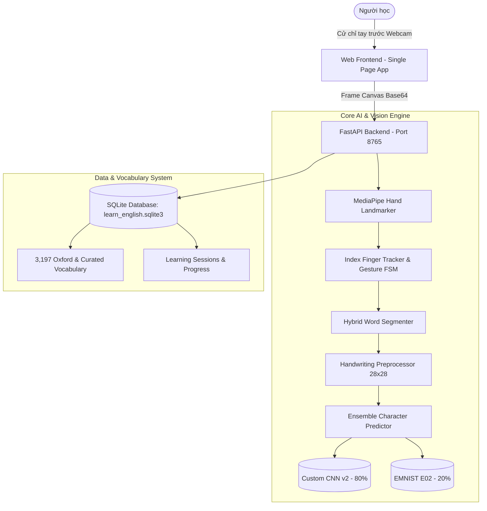

# AirWrite Learn English ✍️🎓
### Nền tảng Học Từ Vựng Tiếng Anh Thông Minh qua Tương Tác Viết Trong Không Khí (AirWriting)

[](https://www.python.org/)
[](https://fastapi.tiangolo.com/)
[](https://tensorflow.org/)
[](https://developers.google.com/mediapipe)
[](https://sqlite.org/)
[](https://pytest.org/)

---

## 📌 Giới thiệu Tổng quan

**AirWrite Learn English** là một hệ thống ứng dụng Web giáo dục tương tác thông minh, kết hợp công nghệ **Thị giác máy tính (Computer Vision)** và **Học sâu (Deep Learning)** nhằm cho phép người dùng viết các chữ cái và từ tiếng Anh trong không gian 3 chiều trước webcam máy tính mà không cần bất kỳ thiết bị đeo hay bút cảm ứng đắt tiền nào.

Hệ thống tự động bóc tách quỹ đạo cử chỉ đầu ngón tay, dựng lại ảnh nét vẽ trên Canvas kỹ thuật số, sử dụng mạng nơ-ron tích chập (Ensemble CNN) để nhận diện cả từ hoàn chỉnh (**Isolated Whole-Word Recognition**), đồng thời tích hợp trợ lý tra cứu từ điển và học từ vựng tiếng Anh theo phương pháp Spaced Repetition hoàn toàn cục bộ (**Local-first, 100% Privacy-preserving**).

---

## 🏗️ Kiến trúc Hệ thống (System Architecture)

Dự án được thiết kế theo mô hình **Client-Server phân tách (Decoupled Web Architecture)**:



### 4 Khối chức năng cốt lõi:
1. **Vision & Gesture Tracking Subsystem:** Sử dụng **MediaPipe Hand Landmarker** (`models/hand_landmarker.task`) xác định 21 điểm khớp tay thời gian thực với độ trễ thấp; bộ lọc làm mượt hàm mũ tọa độ ngón trỏ (Landmark 8) và bộ nhận diện cử chỉ: Giơ 1 ngón trỏ (Vẽ), Xòe bàn tay (Tạm dừng), Nắm đấm (Hoàn thành), Giơ 2 ngón tay (Xóa nét gần nhất).
2. **Digital AirCanvas & State Machine:** Máy trạng thái hữu hạn FSM (`IDLE` $\rightarrow$ `DRAWING` $\rightarrow$ `PAUSED` $\rightarrow$ `DONE`) quản lý độc lập canvas nét vẽ nhị phân chuẩn hóa, không lưu trữ video webcam raw để bảo vệ tuyệt đối quyền riêng tư.
3. **AI Handwriting Recognition Pipeline:**
   * **Tiền xử lý:** Chuẩn hóa nhị phân Otsu, trích xuất bounding box và co dãn bảo toàn tỷ lệ khung hình về ma trận chuẩn `28x28` pixel.
   * **Phân đoạn cả từ (Hybrid Word Segmenter):** Kết hợp phân tích thành phần liên thông (Connected Component Analysis) và biểu đồ chiếu dọc (Vertical Projection Profile) để tự động bóc tách từng chữ cái trong từ mà người dùng vẽ.
   * **Mô hình Ensemble CNN:** Kết hợp sức mạnh của 2 mô hình học sâu:
     * *Mô hình chính (Trọng số 0.80):* `artifacts/airwrite_custom_identity/v2/model.keras` (CNN 4 lớp huấn luyện trên 3,994 ảnh nét vẽ AirWrite thực tế).
     * *Mô hình phụ (Trọng số 0.20):* `artifacts/emnist_letters_identity/v1/model.keras` (Mô hình EMNIST Letters Identity đạt độ chính xác 93.30%).
4. **Intelligent Vocabulary & Translation Assistant:** Cơ sở dữ liệu SQLite cục bộ (`data/learn_english.sqlite3`) chứa **3,197 từ vựng** chuẩn hóa kèm bản dịch tiếng Việt, phiên âm, từ loại, định nghĩa, từ đồng nghĩa/trái nghĩa và ví dụ ngữ cảnh; hỗ trợ cơ chế tra cứu thích ứng sai số 4 lớp và 4 chế độ học từ vựng.

---

## 📂 Cấu trúc Thư mục Dự án

```text
airwrite-vocab-assistant/
│
├── backend/                             # [BACKEND] Máy chủ FastAPI
│   ├── api/
│   │   ├── __init__.py
│   │   └── routes.py                    # 14 RESTful API endpoints
│   ├── domain/
│   │   ├── __init__.py
│   │   └── airwrite_runtime.py          # Cầu nối nghiệp vụ (Bridge) giữa API và AI Engine
│   ├── storage/
│   │   ├── __init__.py
│   │   ├── database.py                  # Lớp truy xuất SQLite & thuật toán tra cứu 4 lớp
│   │   ├── vocab_seeds.py               # Hạt giống từ vựng và chủ đề bài học
│   │   └── vocab_2000.json              # Kho từ vựng chuẩn 2,000+ từ Oxford
│   ├── app.py                           # Khởi tạo FastAPI, CORS và static mounting
│   └── run.py                           # Entrypoint khởi chạy server Uvicorn (Port 8765)
│
├── frontend/                            # [FRONTEND] Ứng dụng Single Page Application (SPA)
│   ├── index.html                       # Giao diện web ngữ nghĩa HTML5
│   ├── src/
│   │   └── app.js                       # Logic camera browser, WebSocket/Fetch, Speech API
│   └── styles/
│       └── app.css                      # Giao diện Dark Glassmorphism hiện đại
│
├── app/                                 # [CORE ENGINE] Thư viện thị giác và nhận diện nét vẽ
│   ├── camera/                          # Luồng camera và xử lý frame OpenCV (Desktop)
│   ├── drawing/                         # Canvas ảo, StrokeManager, State Machine
│   ├── inference/                       # CharacterPredictor, EnsemblePredictor, Bundle Loader
│   ├── ml/                              # Kiến trúc mô hình CNN, Data loaders, Evaluators
│   ├── preprocessing/                   # Chuẩn hóa ảnh 28x28, BoundingBox, Resizer
│   ├── vision/                          # MediaPipe detector, ngón trỏ tracker, bộ nhận diện cử chỉ
│   ├── word_builder/                    # Bộ ghép từ từng ký tự (Desktop)
│   ├── word_recognition/                # Bộ phân đoạn từ Hybrid và WholeWordService
│   ├── utils/                           # Quản lý cấu hình Settings tập trung (.env)
│   └── main.py                          # Ứng dụng Desktop OpenCV độc lập (Legacy Prototype)
│
├── artifacts/                           # [AI ARTIFACTS] Mô hình học máy và minh chứng nghiên cứu
│   ├── airwrite_custom_identity/v2/     # Mô hình CNN Custom v2 chính thức (Primary Model)
│   │   ├── model.keras                  # Trọng số Keras (Weight = 0.80)
│   │   └── *.json                       # Metadata, nhãn identity, nhãn hoa/thường
│   ├── emnist_letters_identity/v1/      # Mô hình EMNIST Identity v1 (Support Model)
│   │   ├── model.keras                  # Bản sao checkpoint E02 (Weight = 0.20)
│   │   └── experiments/E01, E02/        # Dữ liệu thực nghiệm đối sánh trong Luận văn
│   ├── models/                          # Model v0.1.0 gốc (Minh chứng báo cáo Đồ án)
│   └── reports/                         # Biểu đồ training history, confusion matrix
│
├── models/                              # [VISION ASSETS]
│   └── hand_landmarker.task             # Mô hình 21 điểm khớp tay MediaPipe Task Vision
│
├── data/                                # [DATA STORAGE]
│   ├── learn_english.sqlite3            # CSDL SQLite nhúng 7 bảng (3,197 từ vựng)
│   ├── raw_airwrite/                    # Dataset gốc 3,994 ảnh nét vẽ A-Z
│   └── manifests/                       # Bảng phân chia tập Train / Val / Test (70/15/15)
│
├── scripts/                             # [TOOLING] Bộ công cụ huấn luyện & đánh giá
│   ├── train_character_model.py         # Huấn luyện mô hình Custom CNN
│   ├── train_emnist_letters_model.py    # Huấn luyện mô hình EMNIST Identity
│   ├── evaluate_airwrite_identity_model.py # Đánh giá mô hình trên tập kiểm thử
│   └── build_standard_oxford_vocab.py   # Xây dựng kho từ vựng SQLite từ Oxford corpus
│
├── tests/                               # [TEST SUITE] 380 bài kiểm thử tự động
│   ├── test_vocabulary_lookup.py        # Kiểm thử tính năng tra cứu từ điển và ngữ pháp
│   └── ...                              # Toàn bộ unit/integration tests cho các subsystem
│
├── pyproject.toml                       # Cấu hình chuẩn cho Pytest, Ruff, Mypy
├── requirements.txt                     # Toàn bộ thư viện phụ thuộc hợp nhất (Core, Web, AI, Test)
├── .env.example                         # File cấu hình biến môi trường mẫu
└── README.md                            # Tài liệu hướng dẫn sử dụng chính thức
```

---

## ⚙️ Yêu cầu Hệ thống & Cài đặt

### 1. Yêu cầu tiên quyết:
* **Hệ điều hành:** Windows 10/11, macOS hoặc Linux.
* **Python:** Phiên bản **Python 3.11** (khuyến nghị), tương thích tốt với 3.12 và 3.13.
* **Webcam:** Webcam tích hợp hoặc camera USB có độ phân giải tối thiểu 720p (30 FPS).
* **Trình duyệt Web:** Google Chrome, Microsoft Edge, Brave hoặc Firefox hỗ trợ WebRTC và Web Speech API.

### 2. Các bước cài đặt:

```bash
# 1. Di chuyển vào thư mục dự án
cd airwrite-vocab-assistant

# 2. Khởi tạo môi trường ảo Python
python -m venv .venv

# 3. Kích hoạt môi trường ảo
# Trên Windows (PowerShell):
.\.venv\Scripts\Activate.ps1
# Trên Linux/macOS:
source .venv/bin/activate

# 4. Cài đặt toàn bộ các gói phụ thuộc (chỉ với 1 lệnh duy nhất)
pip install --upgrade pip
pip install -r requirements.txt
```

### 3. Cấu hình biến môi trường:

Sao chép file mẫu `.env.example` thành `.env`:
```bash
copy .env.example .env     # Trên Windows
cp .env.example .env       # Trên Linux/macOS
```

File `.env` đã được thiết lập sẵn các đường dẫn chuẩn cho cả 2 mô hình Ensemble và MediaPipe:
```ini
HAND_LANDMARKER_MODEL_PATH=models/hand_landmarker.task
IDENTITY_MODEL_PATH=artifacts/airwrite_custom_identity/v2/model.keras
EMNIST_SUPPORT_MODEL_PATH=artifacts/emnist_letters_identity/v1/model.keras
```

---

## 🚀 Hướng dẫn Khởi chạy Ứng dụng

### Cách 1: Chạy Web Application (Khuyến nghị chính thức)

Khởi động máy chủ FastAPI Backend:
```bash
python -m backend.run
```
*Hoặc sử dụng lệnh Uvicorn trực tiếp:*
```bash
uvicorn backend.app:app --host 127.0.0.1 --port 8765
```

Mở trình duyệt Web và truy cập vào địa chỉ:
👉 **[http://127.0.0.1:8765](http://127.0.0.1:8765)**

Tại đây, bạn cho phép quyền truy cập Camera để bắt đầu trải nghiệm ứng dụng Web Learn English.

---

### Cách 2: Chạy Desktop Prototype (Bản cửa sổ OpenCV)

Nếu muốn trải nghiệm phiên bản cửa sổ máy tính nguyên bản ban đầu:
```bash
python app/main.py
```
*Nhấn phím `Q` hoặc `ESC` để thoát ứng dụng Desktop.*

---

## 🖐️ Hướng dẫn Sử dụng Cử chỉ Điều khiển

Hệ thống nhận diện cử chỉ bàn tay qua camera bằng mô hình MediaPipe với độ ổn định cao:

| Cử chỉ (Gesture) | Trạng thái máy (FSM) | Ý nghĩa thao tác |
| :--- | :--- | :--- |
| ☝️ **Giơ 1 ngón trỏ** | `DRAWING` | Hạ bút xuống và bắt đầu vẽ nét chữ trong không gian. |
| 🖐️ **Xòe hết bàn tay** | `PAUSED` | Nhấc bút lên / Tạm dừng (để chuyển nét hoặc sang chữ cái tiếp theo trong từ). |
| ✊ **Nắm tay lại (nắm đấm)** | `DONE` | Hoàn thành từ. Hệ thống tự động tiền xử lý, phân đoạn và nhận dạng cả từ. |
| ✌️ **Giơ 2 ngón tay** | `PAUSED` | Xóa nét vẽ vừa viết gần nhất (Undo stroke) để viết lại nét hỏng mà không mất toàn bộ từ. |

---

## 📚 Tính năng Học Từ vựng & Dịch thuật Thông minh

### 1. Cơ chế Tra cứu & Sửa lỗi chữ viết tay 4 lớp
Khi người dùng viết một từ trên không và commit kết quả, Backend kích hoạt thuật toán tìm kiếm 4 lớp tại [`backend/storage/database.py`](file:///c:/Code/airwrite-vocab-assistant/backend/storage/database.py):
1. **Lớp 1 - Khớp chính xác (Exact Match):** So khớp trực tiếp với từ khóa gốc trong từ điển.
2. **Lớp 2 - Tra cứu dạng bất quy tắc (Irregulars):** Viết `went`/`gone` $\rightarrow$ dịch nghĩa từ `go`; viết `children` $\rightarrow$ dịch nghĩa từ `child`.
3. **Lớp 3 - Bóc tách ngữ pháp (Morphological Fallback):** Tự động lược bỏ các hậu tố thì và số nhiều: `-ies` $\rightarrow$ `-y`, `-es`, `-s`, `-ing`, `-ed`, nhân đôi phụ âm (`running` $\rightarrow$ `run`, `playing` $\rightarrow$ `play`).
4. **Lớp 4 - Tìm kiếm mờ (Fuzzy Levenshtein Distance $d \le 1$):** Bù trừ sai số trong trường hợp nhận dạng nhầm 1 nét vẽ, tìm từ có độ tương đồng cao nhất.

### 2. Bốn chế độ Luyện tập Từ vựng (Learning Modes):
* **Anh $\rightarrow$ Việt (`en_to_vi`):** Hiển thị từ vựng tiếng Anh, người học chọn hoặc nhập nghĩa tiếng Việt tương ứng.
* **Việt $\rightarrow$ Anh (`vi_to_en`):** Hiển thị nghĩa tiếng Việt, người học nhập từ tiếng Anh chuẩn xác.
* **Viết trên không (`airwrite`):** Hiển thị nghĩa tiếng Việt, người học sử dụng ngón tay viết toàn bộ từ tiếng Anh trong không gian để trả lời bài kiểm tra.
* **Điền từ khuyết (`cloze`):** Đọc định nghĩa ngữ cảnh và điền từ vựng còn thiếu vào chỗ trống.

---

## 🧪 Kiểm thử Tự động (Automated Testing)

Dự án sở hữu bộ kiểm thử tự động toàn diện với **380 bài test**:

```bash
# Chạy toàn bộ test suite
pytest

# Chạy kiểm tra riêng luồng tra cứu từ điển và ngữ pháp
pytest tests/test_vocabulary_lookup.py

# Chạy kiểm thử kèm đo độ phủ mã nguồn (Code Coverage)
pytest --cov=app --cov=backend
```

Kiểm tra định dạng và chuẩn linter:
```bash
# Kiểm tra linter với Ruff
ruff check app backend

# Kiểm tra kiểu tĩnh với Mypy
mypy app backend
```

---

## 📜 Giấy phép & Tuyên bố Bản quyền

Dự án được xây dựng và phát triển phục vụ mục đích nghiên cứu học thuật và đồ án tốt nghiệp ngành Công nghệ Thông tin. Mọi tài nguyên mô hình, dữ liệu nét vẽ và mã nguồn được quản lý theo quy định học thuật nội bộ.
