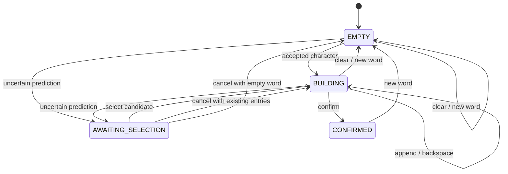

# Word Builder State Flow

## Scope

Sprint 11E receives completed `PredictionResult` events and builds one case-preserved word in memory.
It does not load the model, preprocess images, call translation, validate a dictionary, or persist
history.

## Domain Objects

- `SupportedCharacterSet`: aligned identity, lowercase and uppercase label mappings.
- `CharacterEntry`: identity, rendered character, case snapshot, confidence and source metadata.
- `PendingCharacterSelection`: one event, its immutable case snapshot and ordered Top-K candidates.
- `ConfirmedWord`: immutable original word, canonical lookup form and exact character entries.
- `WordBuilderResult`: public action result consumed by the renderer and `app.main`.

`CharacterSource` distinguishes model accepted characters, user-selected candidates, and optional
manual input. Canvas pixels are never retained in the word buffer.

## States



`CONFIRMED` is immutable for Sprint 11. Backspace and append are rejected until the user starts a
new word.

## Prediction Rules

| Prediction status | Word Builder behavior |
| --- | --- |
| `ACCEPTED` | Append Top-1 as `AUTO_ACCEPTED` when auto-append is enabled |
| `UNCERTAIN` | Create a pending selection; do not append automatically |
| `SKIPPED_EMPTY` | Keep the word unchanged |
| `FAILED` | Keep the word unchanged and return an error action |

If auto-append is disabled, an accepted prediction also becomes a pending selection. If uncertain
selection is disabled, an uncertain event is ignored rather than auto-appended.

## Prediction Identity

`CompletionRecognitionCoordinator` assigns a unique `prediction_id` to each auto or manual
prediction event. `WordBuilder` rejects an ID that is already processed or currently pending.

Duplicate characters remain valid when their IDs differ:

```text
P / pred_1 -> P
P / pred_2 -> PP
P / pred_2 again -> duplicate ignored
```

Cancelled pending IDs are marked processed. A max-length rejection is not marked processed, which
allows a user to backspace and retry the event through an explicit controller call. Starting a new
word clears the bounded per-word ID set.

## Canvas Coordination

```text
Accepted prediction
-> append succeeds
-> optional canvas clear
-> drawing state READY

Uncertain prediction
-> pending selection
-> keep canvas for comparison
-> user selects a candidate
-> append succeeds
-> optional canvas clear
```

Canvas is not auto-cleared for failed, empty, duplicate, blocked, or max-length results. Pending
cancellation clears the canvas by default so the user can redraw the character.
Clearing the canvas (`C`) and clearing the word (`K`) are separate actions.

## Keyboard Priority

1. Quit: `Q` or `ESC`.
2. Pending actions: `1`, `2`, `3`, `X`.
3. Case controls: `L`, `U`, `Y`, `Z`.
4. Word actions: Backspace/`B`, `K`, Enter, `N`.
5. Canvas save/preprocess/predict/dataset/clear actions.
6. Drawing fallback: Space and `D`.

`app.main` converts OpenCV key codes to controller methods. Raw key codes do not enter the domain
model.

## Sprint 12 Handoff

Only `ConfirmedWord` is intended to cross into the planned Translation and Example Generation
workflow. Sprint 11 does not call translation after each appended character and does not store a
confirmed word in a database.
